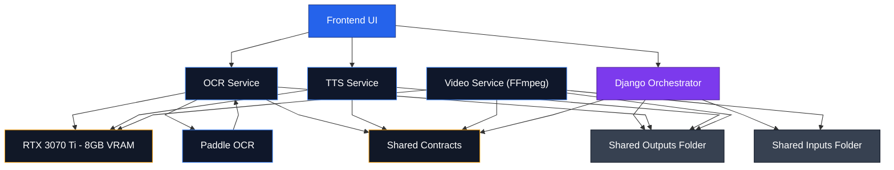

# MangaNarrator

MangaNarrator is a production-ready, modular AI media automation platform that converts static visual content into structured, emotion-aware narrated video.

Built as a reusable AI workflow foundation, it combines vision models, structured data contracts, emotion propagation, configurable speech synthesis, and deterministic video rendering within a scalable microservice architecture.

While currently applied to manga-style visual narration, the underlying system is designed to support broader AI-driven media generation and experimentation across multiple content formats.

---

## 🚀 Problem & Solution

Manual narration and video adaptation of visual content is labor-intensive and difficult to scale.

MangaNarrator provides an end-to-end automated system that:

1. Extracts dialogue and structured metadata from images (e.g., structured comic-style images) using OCR
2. Attaches speaker and emotion context at the dialogue level
3. Generates configurable, emotion-aware TTS output
4. Produces synchronized video through deterministic FFmpeg composition
5. Supports batch execution through structured run-based orchestration

The system is built with scalability, traceability, and GPU-constrained local inference in mind.

---
## ✅ Current Capabilities

The system is fully operational and supports:

- End-to-end execution from raw image input to rendered video output
- Structured OCR extraction with dialogue-level identifiers
- Emotion-aware TTS generation with configurable inference controls
- Deterministic FFmpeg-based video assembly
- Batch processing of multi-chapter inputs
- Frontend-based orchestration and execution control

MangaNarrator operates today as a complete, working AI pipeline.

Beyond its current application, the architecture is intentionally designed to serve as a reusable base for additional AI-driven media workflows, enabling adaptation to new content formats, interaction models, and automated storytelling systems.

---

## 🏗 System Architecture

Each component operates as an isolated service with clearly defined contracts, enabling independent development, testing, and scaling.

---

## 🧩 Repositories for the independent services

- **[manganarrator_orchestrator](https://github.com/whenigetout/manganarrator_orchestrator)**  
  Django-based orchestration layer coordinating pipeline execution and I/O.

- **[manganarrator_frontend](https://github.com/whenigetout/manganarrator_frontend)**  
  TypeScript frontend for managing runs, previewing OCR output, and triggering TTS/video builds.

- **[manganarrator_ocr](https://github.com/whenigetout/manganarrator_ocr)**  
  Vision-based OCR service extracting dialogue, bounding boxes, speaker metadata, and emotion labels.

- **[manganarrator_tts](https://github.com/whenigetout/manganarrator_tts)**  
  Emotion-aware text-to-speech engine with configurable inference parameters.

- **[manganarrator_video](https://github.com/whenigetout/manganarrator_video)**  
  FFmpeg-driven deterministic video assembly module.

- **[manganarrator_contracts](https://github.com/whenigetout/manganarrator_contracts)**  
  Shared schemas and models used across services for structured data exchange.

- **[manganarrator_paddle_ocr](https://github.com/whenigetout/manganarrator_paddle_ocr)**  
  PaddleOCR-based helper module for Dialogue/Text Bounding Box mapping support.

---

## ⚙️ Engineering Decisions

- UUID-based traceability for every image and dialogue unit across the pipeline
- Run ID orchestration for large batch processing (multi-chapter support)
- Strict shared contracts layer for cross-service schema consistency
- Emotion metadata propagation from OCR → TTS for expressive synthesis
- Deterministic FFmpeg command generation for reproducible builds
- Service isolation to prevent tight coupling
- Local GPU inference optimized for 8GB VRAM constraints
- Clear separation between orchestration, compute services, and UI layer

---

## 🛠 Technology Stack

**Backend & Orchestration**
- Python
- Django

**Frontend**
- TypeScript

**Media & Rendering**
- FFmpeg

**AI & Inference**
- Vision/OCR models
- Emotion-aware TTS engines
- Local GPU inference workflows (8GB VRAM optimized)

**Architecture**
- Service-oriented design
- Shared schema contracts
- UUID-based pipeline tracking

---

## 🎯 Design Principles

- Automation-first architecture
- Deterministic and reproducible outputs
- Service decoupling and modularity
- Strong data contracts across boundaries
- Scalable batch execution model
- Extensibility for future AI modules and deployment environments

---

## 🔮 Roadmap

- Refining the preview in the frontend
- Distributed worker queue support
- Advanced timeline editor in frontend
- Multi-speaker emotion control
- Finetuning the current voices for reliable, predictable emotion-aware TTS synthesis
- More voices for TTS and finetuning
- Cloud-deployable inference option
- Performance benchmarking dashboard
- Speaker recognition across different chapters
- RVC integration for custom voice cloning for the manual voice overs

---

## 🌐 Platform Vision

MangaNarrator is designed not merely as a single-purpose tool, but as a modular AI media infrastructure layer.

Its architecture enables:

- Reuse of OCR and structured extraction pipelines
- Swappable model backends across services (LLMs, OCR engines, TTS models)
- Reuse of emotion-aware TTS generation modules
- Adaptation to new visual, interactive, or narrative formats
- Extension into experimental AI-driven media applications

The long-term goal is to evolve this system into a flexible foundation for scalable AI-powered storytelling and interactive media experiences.

---

## 📌 Project Status

MangaNarrator is fully functional and production-capable in its current architecture.

All core services — OCR, TTS, orchestration, and video rendering — are implemented and work as a complete system.

Active development focuses on performance optimization, automation maturity, distributed execution support, and expansion of the platform as a generalized AI media workflow foundation.

